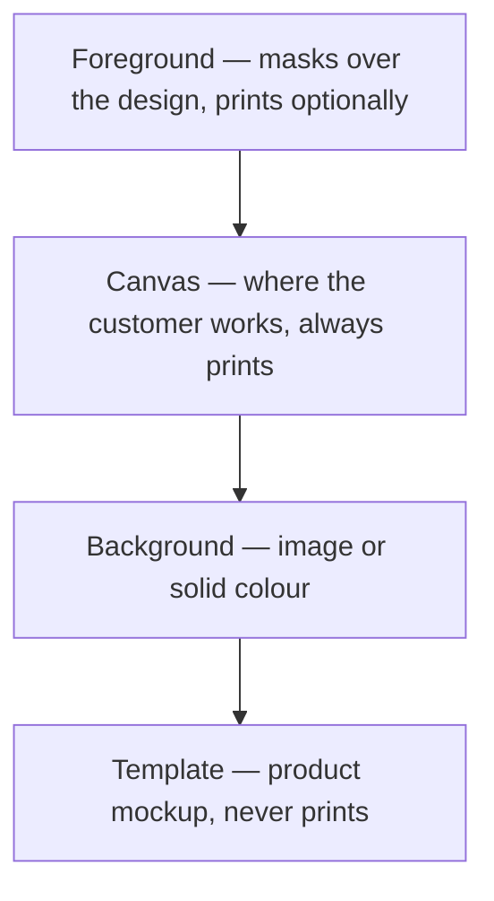

To build a design idea in PitchPrint you need to know how its canvas is stacked. This article covers the four layers first, then how they combine into the three design types.

## The four canvas layers

From bottom to top: **Template**, **Background**, **Canvas** and **Foreground**.

<Frame>
  
</Frame>

<AccordionGroup>
  <Accordion title="Template: the product mockup" icon="shirt">
    The lowest layer (purple in the diagram above). It holds a single image and is dormant in most designs. Its job is to show the customer how their work will look on the finished product.

    Use it for print-on products like a t-shirt, mug, cap or scarf. The t-shirt itself is not printed into the final PDF, only the customer's artwork. You don't need a picture of a t-shirt printed onto an actual t-shirt.

    Set it during design creation or editing by clicking the plus sign next to the **Template Image** label in the toolbox:

    <Frame>
      
    </Frame>

    That opens your uploaded images, where you can select one or upload a new one. Once a template image is set, the canvas offset panel appears at the bottom of the form:

    <Frame>
      
    </Frame>

    Use it to offset the canvas onto the area where designing is allowed:

    <Frame>
      
    </Frame>

    <Warning>
      When a Template layer is used, **Product Width & Height** defines the final product dimensions, not the main canvas dimensions. For the t-shirt example you still specify the designable area and its position using the Canvas Width, Height, Left and Top properties.
    </Warning>
  </Accordion>

  <Accordion title="Background: image or solid color" icon="fill-drip">
    Sits above the template and below the canvas. This is the layer customers manipulate when they edit the background in the app. It can be an image or a solid color.
  </Accordion>

  <Accordion title="Canvas: where customers work" icon="pen-ruler">
    The layer your customer interacts with, placing shapes, text and images. Every design uses it. When customers select items they are clicking this canvas, not the template beneath or the foreground above.

    Its dimensions come from **Product Width & Height**, or from **Canvas Width & Height** when a template is used.

    With a template, you will often want to offset the canvas to part of the template area and make it smaller than the product itself. For a t-shirt, that might be only the chest area. Use the offset form shown above.

    In a plain design like a business card, the canvas is the actual size of the product.
  </Accordion>

  <Accordion title="Foreground: masking over the design" icon="layer-group">
    The topmost layer, used mainly to mask the design canvas. Like the template it holds a single image, but you choose whether it prints.

    <Frame>
      
    </Frame>

    A mouse pad is a common example. The customer designs on a mouse pad image with the design area masked out as a transparent spot.

    <Frame>
      
    </Frame>

    The "Design Here" spot is the main canvas showing through a transparent section of the foreground PNG.

    <Warning>
      Only use partly transparent **PNG** files as a foreground image. A JPEG has no transparency, so it covers the whole canvas and nothing shows through.
    </Warning>
  </Accordion>
</AccordionGroup>

## The three design types

<CardGroup cols={3}>
  <Card title="Plain Designs" img="https://s3.amazonaws.com/helpscout.net/docs/assets/58f1ec6d2c7d3a52b42f8254/images/5975ad2f2c7d3a73488b5214/file-JUkWPDhB4l.png">
    Business cards, letterheads, banners, greeting cards, signs, labels.
  </Card>
  <Card title="Template Designs" img="https://s3.amazonaws.com/helpscout.net/docs/assets/58f1ec6d2c7d3a52b42f8254/images/5975b0462c7d3a73488b5229/file-qWsZg8ZOTQ.png">
    Print-on products such as t-shirts, mugs, caps, rugs, book covers, car stickers, sign boards and roll-up banners, where the customer sees the design in context. The context comes from the template picture.
  </Card>
  <Card title="Foreground Designs" img="https://s3.amazonaws.com/helpscout.net/docs/assets/58f1ec6d2c7d3a52b42f8254/images/5975ad55042863033a1b526c/file-oFYbn83oXe.png">
    Mouse pads, phone covers, laptop cases, picture frames, Facebook banners, and anywhere else customers design underneath an emblem.
  </Card>
</CardGroup>

<Tip>
  If you have a design idea that doesn't obviously fit, email us and we'll work out which of the three categories suits it. The [Solutions section](/docs/tutorial/calendar-design) also walks through building common and complex designs.
</Tip>

## Related articles

<CardGroup cols={2}>
  <Card title="How To Create A Design" icon="plus" href="/docs/tutorial/how-to-create-a-design">
    Build your own design template step by step in the standalone editor.
  </Card>
  <Card title="Design Configuration" icon="gear" href="/docs/tutorial/design-configuration">
    Reference for every design setting across General, Resources and Modules.
  </Card>
  <Card title="Managing your Designs" icon="folder-open" href="/docs/tutorial/managing-your-designs">
    Create, edit, organize and configure designs and categories in the admin.
  </Card>
  <Card title="How to import designs" icon="file-import" href="/docs/tutorial/how-to-import-designs">
    Import ready-made designs from the PitchPrint store into your categories.
  </Card>
</CardGroup>
